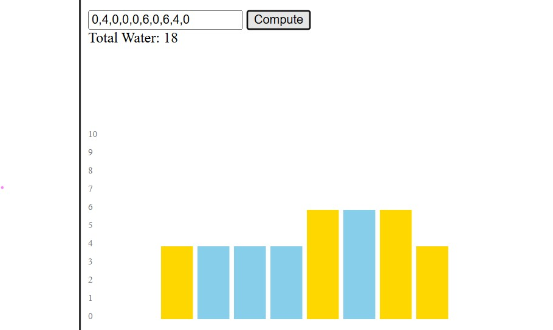

##Water Tank Problem (Trapping Rain Water)

## Description
In this question, we are given an array of heights where each value represents the height of a block. In between the blocks, water is trapped, hence representing a water tank. The goal is to calculate the units of water stored in between the block. 

we can compute the water stored between the blocks using a function trapwater(heights), where heights is the array of heights. 

the output displays the total units of water stored between the blocks. it is also visualized using SVG shapes. 

## APPROACH:
The amount of water stored at any index depends on the shorter boundary between the tallest blocks on its left and right. This is because water would overflow from the smaller side.

so for finding this limiting block, I have used two arrays:
leftMax[i] and rightMax[i], which stores the maximum height encountered from the start and end respectively, upto index 'i'. 

once we obtain the above two arrays, we determine the water stored using the below formula:

water[i]=min(leftMax[i],rightMax[i])-height[i]

if the value becomes negative, we inflate it to zero as water cannot be negative. 

finally, we sum up the water stored at all indices to get the total trapped water.

Below is the visual representation of the trapped water:

